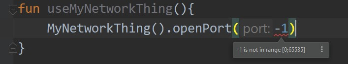
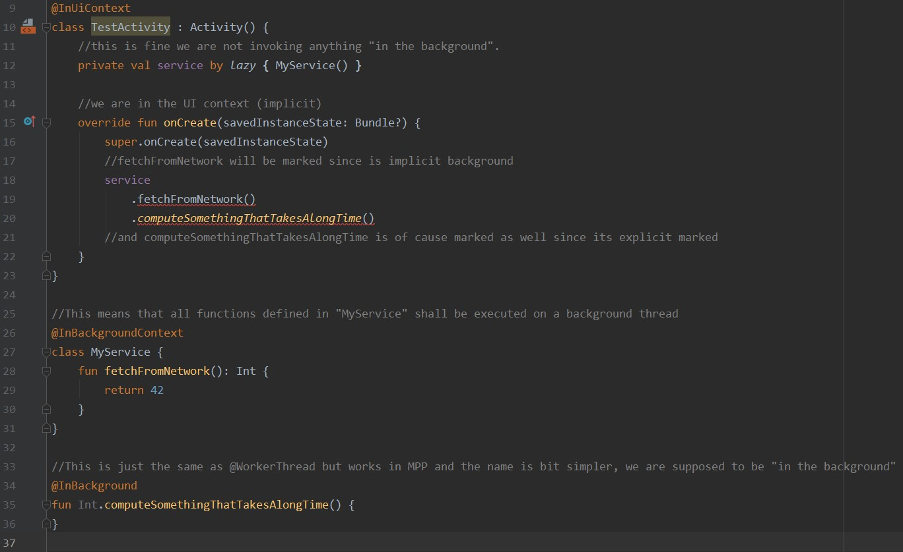

# What is this library

Most of the time Statical compiled languages offers quite a lot of type checking and other features at compile time. 
However stuff as "this number is in this range" is usually not considered to be part of a compiler (excluding contracts and what not)
But its very handy to know whenever a color takes double between 0 and 1 (otherwise throws) or 0 to 255.

This is the same with a lot of other types of "enrichment"  to classes / code, where building it into the compiler (kotlin) would properly not just happen straight out but the help it can offer could / is substantial.

This library alone provide annotations that enriches code; but together with the IDEA plugin 
https://github.com/csense-oss/csense-kotlin-annotations-idea
gives IDE warnings, errors and uses the annotations to provide a RICH and helpful errors and warnings and suggestions.

## Simple examples


### General number ranges / limits

Say you want to say a number is in a certain range, you can do that via various annotations libraries but apart from Jetbrains's which only provide some number ranges, this provides all types of number ranges and the plugin is able to show that as well.
for example:
```kotlin
class MyNetworkThing(){ 
    fun openPort(@IntLimit(from = 0, to = 0xFFFF) port:Int){}
}
```
Then calling that with say "-1" would look like such



### Android and threading
Android have a quite a lot of tools, libraries ect, 
but as of writing , even in android studio 3.6.1, a simple enter click on a line after the inbuilt Statical analysis have concluded you are trying to call background code from say the UI , it just stops working; 

Not only that but there are quite a number of inconveniences, which makes it so cumbersome to use, say annotating every method in an activity / fragment with "UIThread", that people simply doesnt do it.
This is quite sad as it could easily prevent a lot of bugs with thread interleaving.
Luckily we have a solution to that, meet the InUIContext and InBackgroundContext annotations. These work on Class level,and can even be applied externally (say on androids activity class) , meaning that ALL you own classes will then inherit that, thus avoid any annotations to be written before most of the help comes your way.
By then annotating say controllers & services with the InBackgroundContext you essentially have most if not all of the threading in place.
(see the example/android  for an example project).

Here is a short example with a few descriptions:
```kotlin
@InUiContext
class TestActivity : Activity() {
    //this is fine we are not invoking anything "in the background".
    val service by lazy{ MyService() }
    //we are in the UI context (implicit)
    override fun onCreate(savedInstanceState: Bundle?) {
            super.onCreate(savedInstanceState)
            //this will be marked since fetchFromNetwork is implicit background
            service.fetchFromNetwork()
                .computeSomethingThatTakesAlongTime()    
            //and computeSomethingThatTakesAlongTime is of cause marked as well since its explicit marked
    }
}

//this means that all functions defined in "MyServcice" shall be executed on a background thread
@InBackgroundContext
class MyService{
  fun fetchFromNetwork():Int{
  }
}

//This is just the same as @WorkerThread but works in MPP and the name is bit simpler, we are supposed to be "in the background" 
@InBackground
fun Int.computeSomethingThatTakesAlongTime(){
}
```
Which looks as this

